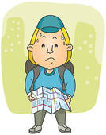

---

## Common English words: P1

(include an image)

---?image=assets/knock.jpeg&position=left&size=50% 100%

Common words for English  
Unit 1

@snap[north]
## @color[red](knock)
@snapend
Who is @color[red](knocking) on the door

---?image=assets/foot.jpeg&position=left&size=50% 100%

## @color[red](foot)

One @color[red](foot) in the grave.

---?image=assets/hard.jpeg&position=left&size=50% 100%

## @color[red](hard)

I am sitting on the @color[red](hard) wall.

---?image=assets/might.jpeg&position=left&size=50% 100%

## @color[red](might)

I @color[red](might) win if I get more than 10.

---?image=assets/different.jpeg&position=left&size=50% 100%

## @color[red](different)

There are so many @color[red](different) animals.

---?image=assets/each.jpeg&position=left&size=50% 100%

## @color[red](each)

@color[red](Each) of us are unique.

---?image=assets/took.jpeg&position=left&size=50% 100%

## @color[red](took)

 Yesterday, he @color[red](took) his coat back. 

(image of an empty rack or something like this.)

---?image=assets/lost_background.jpeg&position=left&size=50% 100%
@snap[north-west]

@snapend
## @color[red](lost)

I think we are @color[red](lost).  
I don't know where we are.

---?image=assets/dark.png&position=left&size=50% 100%

## @color[red](dark)

I can't see anything.  
Its just too @color[red](dark) tonight.

---?image=assets/sun.friend&position=left&size=50% 100%

## @color[red](friend)

 Say hurray! for our @color[red](friends).

---?image=assets/sun.jpeg&position=left&size=50% 100%

## @color[red](same)

The two twins look the @color[red](same).  
I can't tell who is Bruce.

---?image=assets/for.jpeg&position=left&size=50% 100%

## @color[red](for)

What are you looking @color[red](for) in the sitting room (sofa)?

###### End of unit 1

---?image=assets/sun.jpeg&position=left&size=50% 100%

Common words for English unit 2

## found

#### Following the directions on the map, 
####we have @color[red](found) treasure.

---

## @color[red](piece)

#### We have many @color[red](pieces) of the puzzles. 

---

## @color[red](ever)

#### Have you ever @color[red](been) to Europe?

---

## @color[red](front)

#### What is in @color[red](front) of the house?

---

## @color[red](party)

#### Who is going to the birthday @color[red](party)?

---

## @color[red](break)

#### Criminals @color[red](break) peoples' property(name an item).

---

## @color[red](push)

#### If you @color[red](push) the rock hard enough, 
#### you can enter the cave.

---

## @color[red](or)

#### Do you want cake @color[red](or) ice-cream? 
#### You can only have one.

---

## @color[red](buy)

#### What shall I buy for 

---

## @color[red](so)

#### Did she go home
#### I think @color[red](so).

---

## @color[red](kind)

#### Which kind of tablet are we going to use?
#### The Ipad.

---

## @color[red](wish)

#### If you make a wish upon a star,
#### it might come true.

---

## @color[red](carry)

#### The old man @color[red](carrying) the pots over the hill

---

## @color[red](today)

#### I hope @color[red](today) is a great day.

---

## @color[red](eye)

#### Dad sleeps with one @color[red](eye) open.

---

## @color[red](ready)

#### The game is about to start.
#### Are you @color[red](ready)?

---

## @color[red](thought)

#### I @color[red](thought) John went to China, but he is in London.

---

## @color[red](heard)

#### What was that? I @color[red](heard) a noise.

###### End of unit 2
---

Common words for English  
Unit 3

## around

---

## meet

---

## box

---

## must

---

## chair

---

## sing

###### End of unit 3

---

Common words for English  
Unit 4

## naughty
---

## mouth

---

## bridge

---

## upon
 
---

## road

---

## once

---

## together

---

## behind

---

## begin

---

## laugh 

---

## show

---

## face

###### end of unit 4

---
Common words for English  
Unit 5

## always

---

## much

---

## bought

---

## build (double check)

---

## best

---

## because

---

## grow

---

## better

---
## clean

---
## through

---

## write

---

## never 

###### End of unit 5
---

Common words for English  
Unit 6 

## both
---

## shall

---

## own 

---

## hurt 

---

## eight (DCheck)

---

## wash
---
## full

---

## use

---

## wasn't
### was not
---

## care

--- 

## still

---

## early

###### end of unit 6
---

